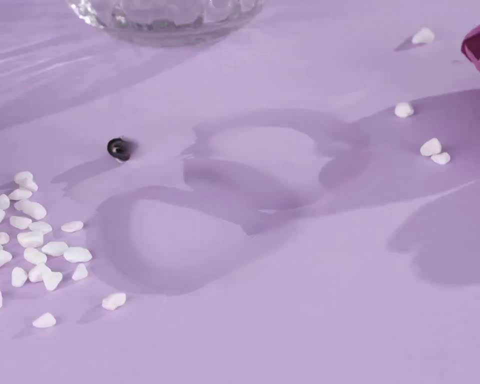
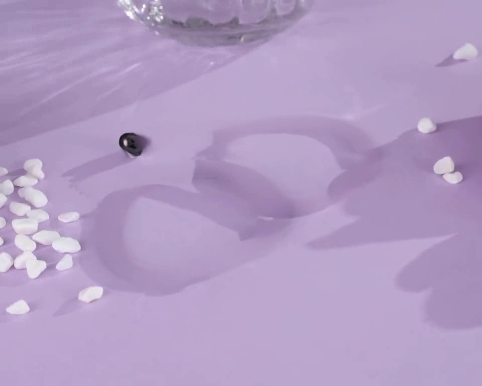
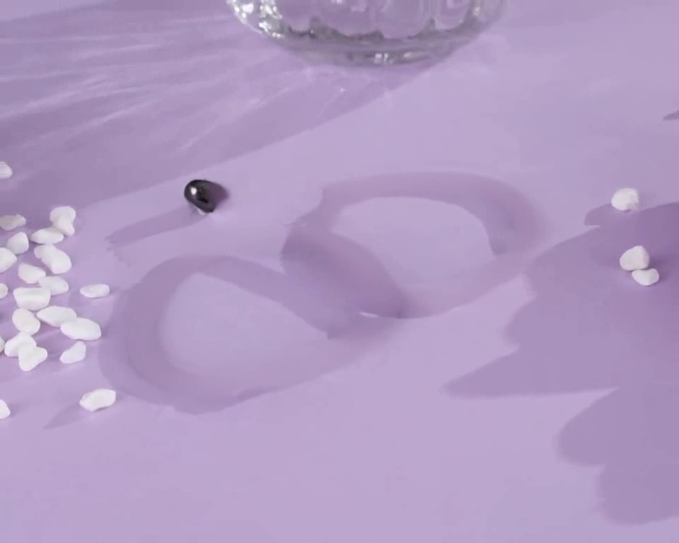
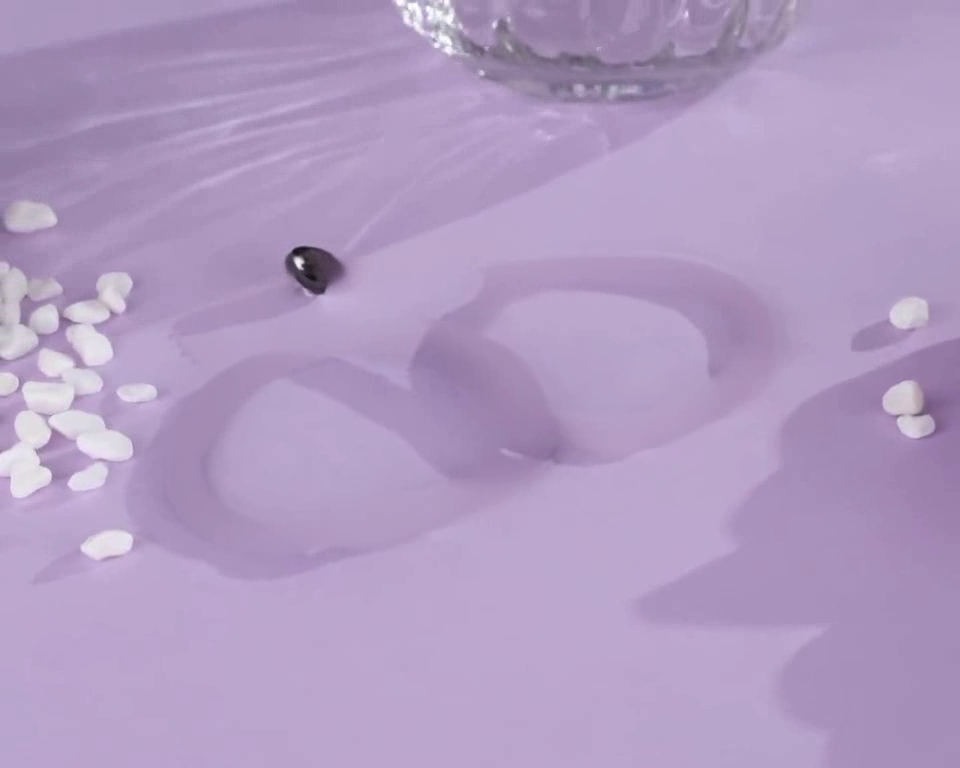

# DiffuEraser 实验记录

## 实验信息

- **日期**: 2026-01-20
- **目标**: 使用 DiffuEraser 移除视频中的手链，生成干净背景
- **模型**: DiffuEraser (2025.01, Diffusion-based)
- **GPU**: NVIDIA V100 32GB (5090 服务器)

## 输入数据

- **源视频**: `custom.mp4`
  - 分辨率: 1280x1024
  - 帧数: 30 帧 (测试)
  - 内容: 紫色桌面上的手链饰品

- **遮罩**: SAM2 分割结果
  - 转换为视频格式 mask.mp4
  - 覆盖两个手链区域

## 实验配置

```bash
CUDA_VISIBLE_DEVICES=2 python run_diffueraser.py \
  --input_video examples/bracelet/video.mp4 \
  --input_mask examples/bracelet/mask.mp4 \
  --video_length 30 \
  --save_path results/bracelet
```

### 环境配置

- **PyTorch 版本**: 2.9.1+cu128 (升级以支持 RTX 5090 sm_120)
- **依赖**: ProPainter 权重、stable-diffusion-v1-5、PCM_Weights

### 代码修复

修改 `diffueraser/diffueraser.py` 的帧率比较逻辑：
```python
# 原始 (导致错误):
if mask_fps != fps:
# 修复为:
if abs(mask_fps - fps) > 0.1:
```

## 实验结果

### 输出文件
```
results/diffueraser/
├── result.mp4           # 修复结果视频
├── frame_01.png         # 第0帧
├── frame_02.png         # 第10帧
├── frame_03.png         # 第20帧
└── frame_04.png         # 第29帧
```

### 效果评估

**评分: 3/10 - 失败**

#### 结果截图

| Frame 0 | Frame 10 |
|---------|----------|
|  |  |

| Frame 20 | Frame 29 |
|----------|----------|
|  |  |

#### 主要问题

1. **阴影残留严重**: 与 ProPainter 相同，手链阴影轮廓完全保留
2. **小物体残留**: 部分珠子/小物体未被完全移除
3. **色彩略有改善**: 相比 ProPainter，填充区域颜色稍微自然一些

#### 失败原因分析

DiffuEraser 的架构是：
1. **第一阶段**: ProPainter 光流传播填充
2. **第二阶段**: Diffusion 模型细化

**问题**：
- 由于使用 ProPainter 作为先验，光流方法的固有局限性被继承
- 当物体阴影在所有帧都存在时，第一阶段已经无法正确填充
- Diffusion 细化阶段无法纠正第一阶段的根本性错误

### 处理速度

- 30 帧处理时间: ~121 秒
- 平均速度: ~4 秒/帧
- 比 FLUX Fill (~23s/帧) 快，但比 LaMa (~0.4s/帧) 慢

## 与其他方法对比

| 特性 | DiffuEraser | FLUX Fill | LaMa | ProPainter |
|------|-------------|-----------|------|------------|
| 方法类型 | ProPainter + Diffusion | Diffusion 生成 | CNN 修复 | 光流传播 |
| 阴影处理 | ❌ 失败 | ✅ 成功 | ✅ 成功 | ❌ 失败 |
| 颜色还原 | ⚠️ 一般 | ✅ 优秀 | ⚠️ 有色差 | ❌ 差 |
| 处理速度 | ~4s/帧 | ~23s/帧 | ~0.4s/帧 | ~0.3s/帧 |
| 自动化适配 | ✅ 无需prompt | ❌ 依赖prompt | ✅ 无需prompt | ✅ 无需prompt |
| 评分 | 3/10 | 8/10 | 6/10 | 2/10 |

## 结论

DiffuEraser **不适合**本任务（全程存在物体的移除）：

- 继承了 ProPainter 光流方法的局限性
- 阴影问题无法通过后续 Diffusion 细化解决
- 比纯 ProPainter 略好 (3/10 vs 2/10)，但仍不可用

### 当前最佳方案

对于需要移除全程存在的物体：
1. **LaMa** (6/10): mask 需要膨胀以覆盖阴影，有轻微色差但可接受
2. **FLUX Fill** (8/10): 质量最好但依赖 prompt，不适合自动化

### 可能的解决方向

1. **扩大 mask 覆盖阴影**: 在 SAM2 分割后膨胀 mask 以包含阴影区域
2. **尝试 VideoPainter**: 需要 80GB GPU (A100)
3. **混合方案**: 使用 LaMa/FLUX Fill 逐帧处理 + 视频稳定

## 服务器路径

- 代码: `/data/xuhao/DiffuEraser/`
- 模型权重: `/data/xuhao/DiffuEraser/weights/`
- 输出结果: `/data/xuhao/DiffuEraser/results/bracelet/`
