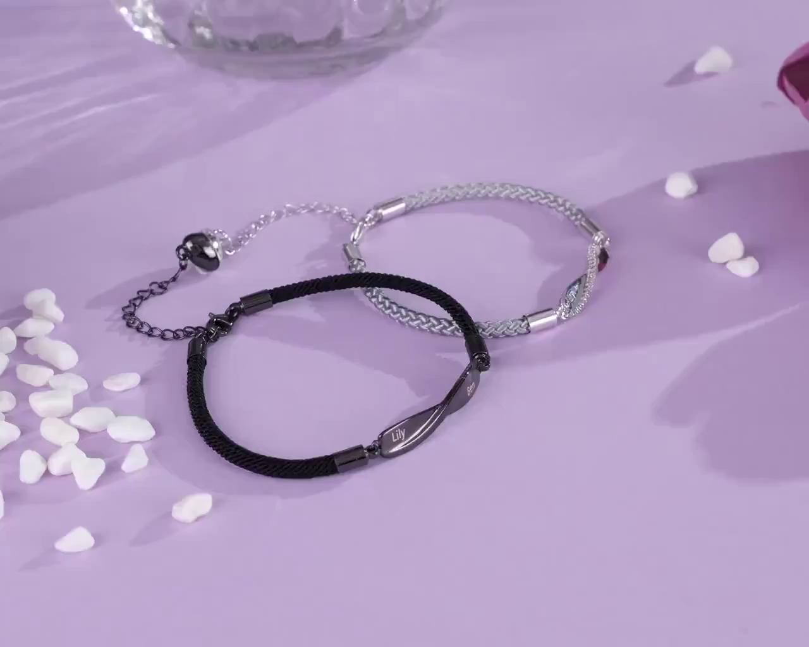

# FLUX Fill 实验记录

## 实验信息

- **日期**: 2025-01-20
- **目标**: 使用 FLUX Fill 逐帧修复视频，移除手链并生成干净背景
- **模型**: FLUX.1-Fill-dev (Black Forest Labs)
- **GPU**: NVIDIA V100 32GB (5090 服务器)

## 输入数据

- **源视频**: `custom.mp4`
  - 分辨率: 1280x1024
  - 帧数: 184 帧
  - 内容: 紫色桌面上的手链饰品

- **遮罩**: SAM2 分割结果 + 膨胀处理
  - 膨胀参数: 50x50 kernel, 3 iterations
  - 填充内部空洞

## 实验配置

```python
import torch
from diffusers import FluxFillPipeline
from PIL import Image

pipe = FluxFillPipeline.from_pretrained(
    "black-forest-labs/FLUX.1-Fill-dev",
    torch_dtype=torch.bfloat16
)
pipe.enable_model_cpu_offload()

# 缩小到处理分辨率 (16 的倍数)
target_w, target_h = 768, 608
image_resized = image.resize((target_w, target_h), Image.LANCZOS)
mask_resized = mask_pil.resize((target_w, target_h), Image.NEAREST)

result = pipe(
    prompt="purple pink tablecloth background, smooth fabric texture",
    image=image_resized,
    mask_image=mask_resized,
    height=target_h,
    width=target_w,
    num_inference_steps=28,
    guidance_scale=30,
).images[0]
```

### 关键参数
- **处理分辨率**: 768x608 (原始 1280x1024 缩小)
- **num_inference_steps**: 28
- **guidance_scale**: 30
- **prompt**: "purple pink tablecloth background, smooth fabric texture"

## 实验结果

### 输出文件
```
results/flux_fill/
├── input.png      # 原始帧 (1280x1024)
├── mask.png       # 膨胀后 mask
└── result.png     # 修复结果 (768x608)
```

### 效果评估

**评分: 8/10 - 效果好但速度慢**

#### 结果对比

| 原始帧 | FLUX Fill 修复结果 |
|--------|-------------------|
|  |  |

#### 优点

1. **颜色还原优秀**: 填充区域颜色与原背景高度一致，紫粉色完美匹配
2. **无明显色差**: 相比 LaMa，几乎没有偏绿/偏白问题
3. **纹理自然**: 生成的背景纹理与周围区域融合良好

#### 问题

1. **速度太慢**: ~23 秒/帧，184 帧需要约 70 分钟
2. **需要降分辨率**: 1280x1024 → 768x608，有信息损失
3. **可能生成幻觉**: 有时会生成不存在的阴影或物体

## 与其他方法对比

| 特性 | FLUX Fill | LaMa | ProPainter |
|------|-----------|------|------------|
| 方法类型 | Diffusion 生成 | CNN 修复 | 光流传播 |
| 颜色还原 | ✅ 优秀 | ⚠️ 有色差 | ❌ 差 |
| 阴影处理 | ✅ 成功 | ✅ 成功 | ❌ 失败 |
| 处理速度 | ❌ ~23s/帧 | ✅ ~0.4s/帧 | ✅ ~0.3s/帧 |
| 显存需求 | ~20GB | ~8GB | ~16GB |
| 评分 | 8/10 | 6/10 | 2/10 |

## 结论

FLUX Fill **质量最好**，但速度是瓶颈：

- 单帧修复效果优秀，颜色还原准确
- 184 帧视频处理需要 ~70 分钟，不适合大规模处理
- 适合对质量要求高、数量少的场景

### 可能的优化方向

1. **使用更快的 GPU**: A100 80GB 可能提速 2-3x
2. **减少 inference steps**: 28 → 15，可能提速 50%
3. **批量处理**: 如果显存允许，多帧并行
4. **混合方案**: FLUX Fill 生成关键帧，LaMa 处理中间帧

## 服务器路径

- 模型缓存: `~/.cache/huggingface/hub/models--black-forest-labs--FLUX.1-Fill-dev/`
- 输出结果: `/data/xuhao/flux_fill_test/`
