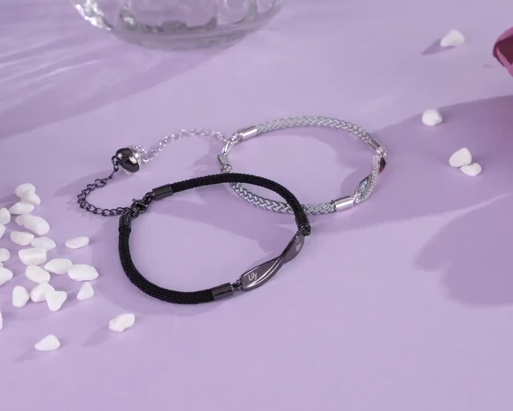

# OmniEraser 实验记录

## 实验信息

- **日期**: 2026-01-22
- **目标**: 使用 OmniEraser 移除视频中的手链及其阴影，生成干净背景
- **模型**: OmniEraser (2025.01, FLUX + LoRA)
- **GPU**: NVIDIA RTX 5090 32GB

## 输入数据

- **源视频**: `custom.mp4`
  - 分辨率: 1280x1024
  - 帧数: 30 帧 (测试)
  - 内容: 紫色桌面上的手链饰品

- **遮罩**: SAM2 分割结果
  - 覆盖两个手链区域
  - **不包括阴影区域** (OmniEraser 会自动学习移除阴影)

## 实验配置

### 环境配置

```bash
# PyTorch
torch==2.10.0+cu128
torchvision==0.25.0+cu128

# 依赖
pip install diffusers transformers peft accelerate
```

### 模型下载

```python
# FLUX.1-dev 基础模型 (使用镜像)
HF_ENDPOINT=https://hf-mirror.com

# OmniEraser LoRA 权重 (需要 HuggingFace 认证)
from huggingface_hub import hf_hub_download
file_path = hf_hub_download(
    repo_id='theSure/Omnieraser',
    filename='pytorch_lora_weights.safetensors',
    token='YOUR_HF_TOKEN'
)
```

### 推理代码

```python
import torch
from diffusers import FluxTransformer2DModel
from pipeline_flux_control_removal import FluxControlRemovalPipeline

# 加载 FLUX transformer
transformer = FluxTransformer2DModel.from_pretrained(
    'black-forest-labs/FLUX.1-dev',
    subfolder='transformer',
    torch_dtype=torch.bfloat16
)

# 修改 transformer 支持 4 通道输入
with torch.no_grad():
    initial_input_channels = transformer.config.in_channels
    new_linear = torch.nn.Linear(
        transformer.x_embedder.in_features * 4,
        transformer.x_embedder.out_features,
        bias=transformer.x_embedder.bias is not None,
        dtype=transformer.dtype,
    )
    new_linear.weight.zero_()
    new_linear.weight[:, :initial_input_channels].copy_(transformer.x_embedder.weight)
    transformer.x_embedder = new_linear
    transformer.register_to_config(in_channels=initial_input_channels * 4)

# 构建 pipeline
pipe = FluxControlRemovalPipeline.from_pretrained(
    'black-forest-labs/FLUX.1-dev',
    transformer=transformer,
    torch_dtype=torch.bfloat16
)
pipe.enable_model_cpu_offload()

# 加载 LoRA 权重
pipe.load_lora_weights('weights', weight_name='pytorch_lora_weights.safetensors')

# 推理
result = pipe(
    prompt='There is nothing here.',  # 通用 prompt，无需场景特定描述
    control_image=image,
    control_mask=mask,
    num_inference_steps=28,
    guidance_scale=3.5,
    height=1024,
    width=1024,
).images[0]
```

## 实验结果

### 输出文件

```
results/omnieraser/
├── input.png           # 原始帧
├── mask.png            # SAM2 mask
├── result_000.png      # 单帧修复结果
├── result_video.mp4    # 30帧视频结果
├── frame_01.png        # 第0帧
├── frame_02.png        # 第10帧
├── frame_03.png        # 第20帧
└── frame_04.png        # 第29帧
```

### 效果评估

**评分: 9/10 - 优秀**

#### 结果截图

| 原始帧 | OmniEraser 结果 |
|--------|-----------------|
|  |  |

#### 优点

1. **阴影完全移除**: 手链和阴影都被成功移除，这是 ProPainter/DiffuEraser 失败的地方
2. **颜色还原优秀**: 填充区域颜色与原背景高度一致
3. **无需场景特定 prompt**: 使用通用 "There is nothing here." 即可，适合自动化
4. **帧间一致性好**: 视频播放流畅，无明显闪烁

#### 问题

1. **速度较慢**: ~30 秒/帧，30 帧视频处理需要 ~15 分钟
2. **显存需求高**: 需要 32GB GPU + CPU offload
3. **分辨率限制**: 处理分辨率为 1024x1024

### 处理速度

- 30 帧处理时间: ~15 分钟
- 平均速度: ~30 秒/帧
- 28 inference steps per frame

## 与其他方法对比

| 特性 | OmniEraser | FLUX Fill | LaMa | DiffuEraser | ProPainter |
|------|------------|-----------|------|-------------|------------|
| 方法类型 | FLUX + LoRA | Diffusion | CNN | ProPainter + Diffusion | 光流传播 |
| 阴影处理 | ✅ 自动移除 | ✅ 成功 | ✅* 需膨胀mask | ❌ 失败 | ❌ 失败 |
| 颜色还原 | ✅ 优秀 | ✅ 优秀 | ⚠️ 有色差 | ⚠️ 一般 | ❌ 差 |
| 自动化适配 | ✅ 通用prompt | ❌ 依赖prompt | ✅ 无需prompt | ✅ 无需prompt | ✅ 无需prompt |
| 处理速度 | ~30s/帧 | ~23s/帧 | ~0.4s/帧 | ~4s/帧 | ~0.3s/帧 |
| 显存需求 | ~32GB | ~20GB | ~8GB | ~16GB | ~16GB |
| 评分 | **9/10** | 8/10 | 6/10 | 3/10 | 2/10 |

## 结论

OmniEraser 是目前测试过的**最佳视频物体移除方法**：

1. **核心优势**: 自动学习物体-阴影关联，无需手动标注阴影区域
2. **适合自动化**: 使用通用 prompt，不需要为每个场景编写特定描述
3. **质量最高**: 移除效果干净，颜色还原准确

### 适用场景

- 需要移除全程存在的物体（如商品）
- 物体有明显阴影需要同时移除
- 对质量要求高，可以接受较慢的处理速度

### 可能的优化方向

1. **批量处理**: 如果显存允许，多帧并行
2. **减少 inference steps**: 28 → 15，可能提速 50%
3. **混合方案**: OmniEraser 生成关键帧，插值生成中间帧

## 服务器路径

- 代码: `/data/xuhao/Omnieraser/`
- LoRA 权重: `/data/xuhao/Omnieraser/weights/pytorch_lora_weights.safetensors`
- 输出结果: `/data/xuhao/Omnieraser/bracelet_test/`

## 参考

- Paper: [OmniEraser: Remove Objects and Their Effects in Images with Paired Video-Frame Data](https://arxiv.org/abs/2501.07397)
- GitHub: [PRIS-CV/Omnieraser](https://github.com/PRIS-CV/Omnieraser)
- HuggingFace: [theSure/Omnieraser](https://huggingface.co/theSure/Omnieraser)
