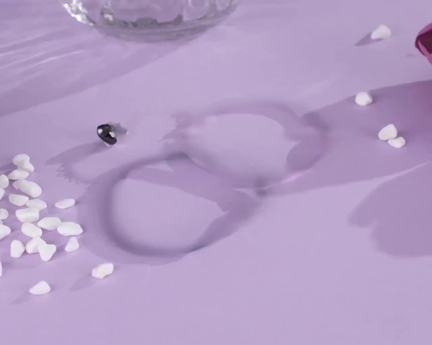
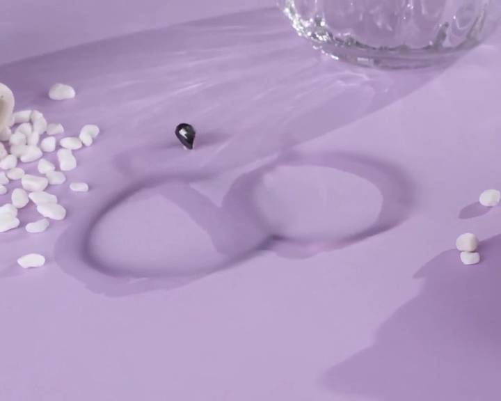
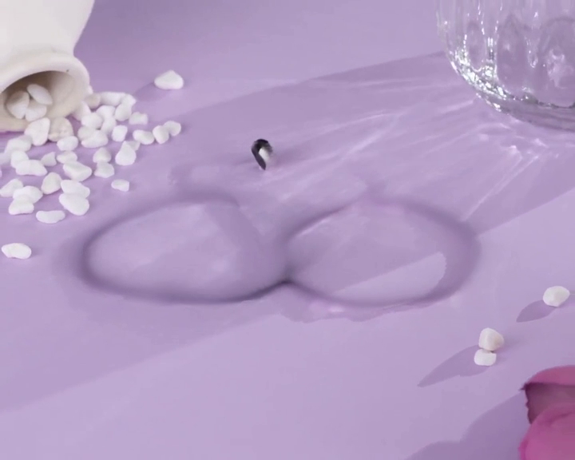
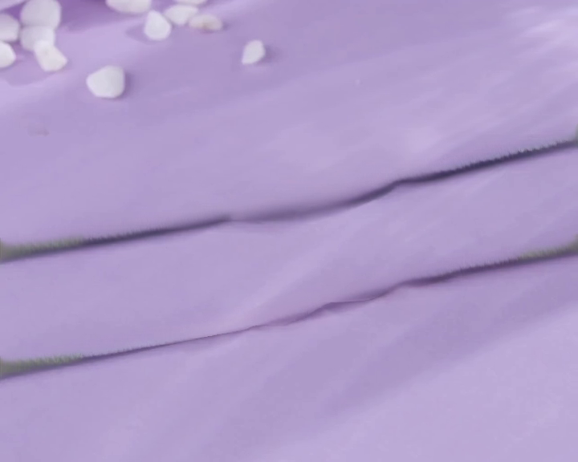

# ProPainter 实验记录

## 实验信息

- **日期**: 2025-01-20
- **目标**: 使用 ProPainter 移除视频中的手链，生成干净背景
- **模型**: ProPainter (ICCV 2023)
- **GPU**: NVIDIA V100 32GB (5090 服务器)

## 输入数据

- **源视频**: `custom.mp4`
  - 分辨率: 1280x1024
  - 帧数: 184 帧
  - 内容: 紫色桌面上的手链饰品

- **遮罩**: SAM2 分割结果 (v5 正负样本点)
  - 格式: 184 张 PNG (从 npz 转换)
  - 覆盖: 两个手链区域

## 实验配置

```bash
python inference_propainter.py \
  -i inputs/bracelet_removal/video.mp4 \
  -m inputs/bracelet_removal/masks \
  -o results/bracelet_removal_720p \
  --height 576 --width 720 \
  --fp16 \
  --save_frames
```

### 参数说明
- `--height 576 --width 720`: 降低分辨率以适应显存
- `--fp16`: 使用半精度以节省显存
- 原始分辨率 (1280x1024) 会 OOM

## 实验结果

### 输出文件
```
results/propainter/
├── bracelet_removal_480x640.mp4  # 480x640 版本
├── bracelet_removal_720p.mp4     # 576x720 版本 (主要结果)
├── masked_in.mp4                 # 输入遮罩可视化
└── frames/                       # 抽帧截图
    ├── frame_001.png (第0帧)
    ├── frame_002.png (第50帧)
    ├── frame_003.png (第100帧)
    └── frame_004.png (第150帧)
```

### 效果评估

**评分: 2/10 - 失败**

#### 结果截图

| Frame 0 | Frame 50 |
|---------|----------|
|  |  |

| Frame 100 | Frame 150 |
|-----------|-----------|
|  |  |

#### 主要问题

1. **阴影残留**: 手链本体被移除，但阴影轮廓完全保留，在桌面上留下明显的圆环痕迹
2. **伪影**: 后半段视频出现横线伪影
3. **填充质量差**: 填充区域颜色不均匀，与周围背景不协调

#### 失败原因分析

ProPainter 是基于**光流传播**的方法，核心原理是：
1. 计算视频帧间的光流
2. 从相邻帧"借用"像素来填补遮罩区域
3. 使用 Transformer 进行时序一致性优化

**局限性**：
- 当目标物体在**整个视频中都存在**时，没有干净的背景帧可以借用
- 阴影在所有帧中都存在，无法通过传播消除
- 不具备"生成"新内容的能力，只能"传播"已有内容

#### 适用场景

ProPainter 更适合：
- 物体只在部分帧出现（如行人穿过画面）
- 有干净背景帧可供参考的场景
- 遮挡物移除（物体被短暂遮挡后恢复）

## 结论

ProPainter **不适合**本任务（全程存在的物体移除）。需要：
1. 使用生成式方法（VideoPainter/FLUX Fill）
2. 更大显存 GPU (80GB A100) 运行 VideoPainter
3. 或尝试逐帧图像修复 + 视频稳定的方案

## 服务器路径

- 模型权重: `/data/xuhao/ProPainter/weights/`
- 输入数据: `/data/xuhao/ProPainter/inputs/bracelet_removal/`
- 输出结果: `/data/xuhao/ProPainter/results/bracelet_removal_720p/`
