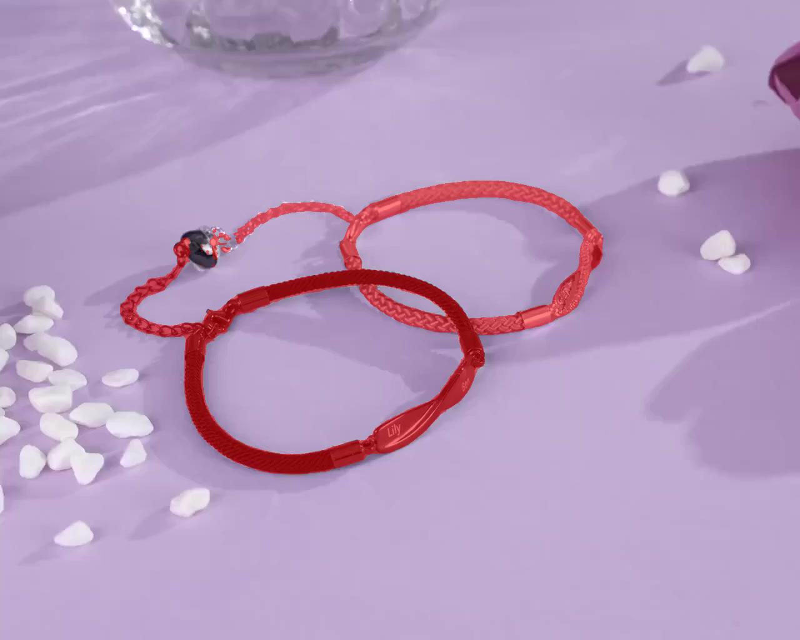
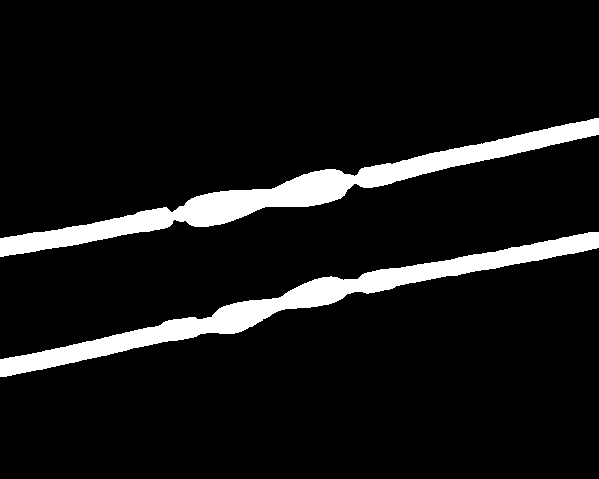
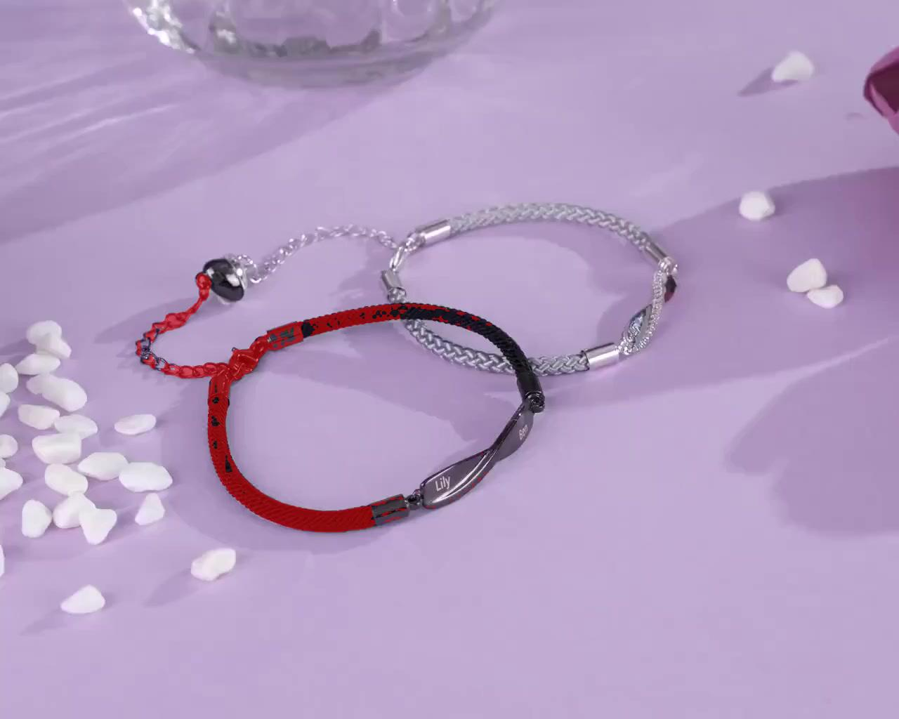

# SAM2 视频分割实验

**日期**: 2026-01-20
**主题**: 对 Scene 1 进行手链分割
**测试用例**: bracelet_to_necklace Scene 1 (1280x1024, 184帧)

---

## 实验背景

使用 SAM2 (Segment Anything Model 2) 对视频中的手链进行分割，生成 mask 序列用于后续的 VideoPainter 修复。

---

## 实验配置

| 参数 | 值 |
|------|-----|
| 模型 | SAM2.1 Hiera Large |
| Checkpoint | sam2.1_hiera_large.pt (898MB) |
| 设备 | 5090 GPU, CUDA, bfloat16 |
| 环境 | wan conda 环境 |

---

## 输入

| 项目 | 值 |
|------|-----|
| 视频 | source_video-Scene-001.mp4 |
| 帧数 | 184 |
| 分辨率 | 1280x1024 |
| 帧格式 | JPEG (scene1_frames/) |

**输入首帧**:


---

## Point Prompts

使用正负样本点击提示（经过多次迭代优化）：

| Object ID | 描述 | 正样本点 | 负样本点 |
|-----------|------|---------|---------|
| 1 | 黑色手链 (Lily) | (550,620), (400,550), (650,700), (300,450) | (500,520), (550,580) |
| 2 | 银色手链 (Ben) | (850,320), (950,400), (650,350) | (750,380) |

**关键**: 负样本点放在手链内部空白区域，排除背景

**迭代过程**:
- v1: 单点击中背景，失败
- v2: 调整点位，黑色手链成功，银色失败
- v3: 银色成功，黑色只分割内部
- v4: 多点覆盖，但包含了手链内部空白区域
- **v5**: 添加负样本排除内部，只分割手链本身 ✅

---

## 实验结果

### 处理统计

| 指标 | 值 |
|------|-----|
| 帧加载速度 | 33 fps |
| 传播速度 | 30 fps |
| 总处理时间 | ~11 秒 |
| 输出 masks | 184 个 PNG 文件 |

### 分割效果

**Mask 叠加可视化** (红色区域为检测到的 mask):



**原始 Mask** (白色为前景):



**观察**:
- ✅ 只分割手链本身，内部空白区域被正确排除
- ✅ 黑色手链 (Lily): 手链带、延长链、名牌、磁扣
- ✅ 银色手链 (Ben): 编织链、金属装饰
- ✅ 适合用于 VideoPainter 修复

### 输出文件

```
scene1_masks/
├── 00000.png  # 首帧 mask
├── 00001.png
├── ...
└── 00183.png  # 末帧 mask (共 184 个)
```

---

## 技术细节

### SAM2 Video Predictor 工作流程

```python
# 1. 初始化
predictor = build_sam2_video_predictor(model_cfg, checkpoint, device)
inference_state = predictor.init_state(video_path=frames_dir)

# 2. 添加点击提示
predictor.add_new_points_or_box(
    inference_state, frame_idx=0, obj_id=1,
    points=[[500, 400]], labels=[1]
)

# 3. 传播到所有帧
for frame_idx, obj_ids, mask_logits in predictor.propagate_in_video(inference_state):
    masks[frame_idx] = (mask_logits > 0.0).cpu().numpy()
```

### 注意事项

1. **帧格式要求**: SAM2 需要 JPEG 帧目录，不能直接处理 MP4
2. **点击位置敏感**: 点击位置会影响分割结果，可能需要迭代调整
3. **多物体支持**: 每个物体需要单独的 obj_id

---

## Box Prompt vs Point Prompt 对比实验

### 实验目的

探索自动化获取 prompt 的方案，避免手动指定坐标。

### 实验设置

对黑色手链使用 box prompt：
```python
box = [250, 400, 700, 750]  # [x_min, y_min, x_max, y_max]
predictor.add_new_points_or_box(..., box=box)
```

### 结果对比

| Prompt 方式 | 黑色手链 | 银色手链 | 内部排除 | 总体 |
|------------|---------|---------|---------|------|
| Point + 负样本 (v5) | ✅ 完整 | ✅ 完整 | ✅ | **最佳** |
| Box prompt | ⚠️ 不完整 | ❌ 漏掉 | ✅ | 较差 |

**Point prompt + 负样本 (v5)** - 完整分割:


**Box prompt** - 黑色不完整，银色漏掉:



### 关键发现

1. **Box prompt 不如预期**: 虽然能排除内部空白，但分割不完整
2. **Point + 负样本仍是最佳**: 需要精心选择正负样本点位
3. **自动化挑战**: 如何自动生成正确的正负样本点仍待解决

### 待探索的自动化方向

1. Grounding DINO → bbox → SAM2 box prompt → **需要后处理补全**
2. 交互式标注工具（人工标注首帧，自动传播）
3. 基于轮廓检测自动生成负样本点

---

## 经验总结

### Point Prompt 最佳实践（手动标注场景）

1. 每个物体使用 3-4 个**正样本**点击点覆盖不同部分
2. 对于环形物体（手链、项链），添加**负样本**点排除内部空白
3. 正样本 (label=1): 点在目标物体上
4. 负样本 (label=0): 点在不想要的区域（如内部空白）

### Box Prompt 局限性

1. 分割可能不完整（漏掉部分区域）
2. 需要每个物体单独的 bbox
3. **不如 Point + 负样本方案可靠**

### 自动化方向（待研究）

1. 交互式标注：人工标注首帧 → SAM2 自动传播到后续帧
2. Grounded SAM 2：文本 → 检测 → 分割（需测试效果）
3. 轮廓分析：初始分割 → 检测环形 → 自动添加负样本点

---

## 结论

1. **SAM2 分割基本成功**，两个手链主体被正确识别
2. **处理速度快**，184 帧仅需 11 秒
3. **mask 质量可用**，但有改进空间
4. **下一步**: 使用 VideoPainter 基于此 mask 进行视频修复

---

## 相关文件

- 分割脚本: 内联 Python (见上方迭代过程)
- 输入帧: `5090:/data/xuhao/pvtt-pipeline-test/samples/scene1_frames/`
- 输出 masks: `5090:/data/xuhao/pvtt-pipeline-test/samples/scene1_masks_v5/`
- 结果图片:
  - [input_frame.jpg](../results/sam2-segmentation/input_frame.jpg) - 输入首帧
  - [mask_overlay.jpg](../results/sam2-segmentation/mask_overlay.jpg) - Point prompt + 负样本 (v5)
  - [mask_overlay_v4_reference.jpg](../results/sam2-segmentation/mask_overlay_v4_reference.jpg) - Point prompt 包含内部 (v4)
  - [mask_box_test.jpg](../results/sam2-segmentation/mask_box_test.jpg) - Box prompt 测试
  - [mask_frame0.png](../results/sam2-segmentation/mask_frame0.png) - 原始 Mask
