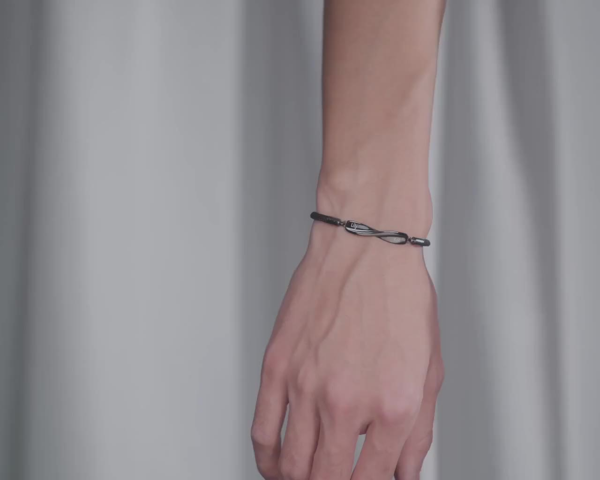

# PySceneDetect 镜头切分实验

**日期**: 2026-01-20
**主题**: 对 Sample 001 源视频进行镜头切分
**测试用例**: bracelet_to_necklace (1280x1024, 24fps, 14.8s)

---

## 实验背景

Etsy 商品视频通常是多镜头的，需要先切分为单镜头片段再进行后续处理 (SAM2 分割、VideoPainter 修复、VideoAnyDoor 插入)。

---

## 实验配置

| 参数 | 值 |
|------|-----|
| 工具 | PySceneDetect 0.6.7.1 |
| 检测方法 | detect-content (内容变化检测) |
| 环境 | 5090 服务器, wan conda 环境 |

---

## 输入视频

| 属性 | 值 |
|------|-----|
| 文件 | source_video.mp4 |
| 时长 | 14.81s |
| 分辨率 | 1280x1024 |
| 帧率 | 23.98 fps |
| 总帧数 | 355 |
| 编码 | H.264 High |

---

## 实验结果

### 检测统计

- **处理速度**: 1171 FPS (0.3秒完成)
- **检测到镜头数**: 3
- **平均镜头时长**: 4.9 秒

### 镜头列表

| Scene # | Start Frame | Start Time | End Frame | End Time | Duration |
|---------|-------------|------------|-----------|----------|----------|
| 1 | 1 | 00:00:00.000 | 184 | 00:00:07.674 | 7.67s |
| 2 | 185 | 00:00:07.674 | 261 | 00:00:10.886 | 3.21s |
| 3 | 262 | 00:00:10.886 | 355 | 00:00:14.806 | 3.92s |

### 切分点时间码

```
00:00:07.674, 00:00:10.886
```

### 输出文件

| 文件 | 大小 | 帧数 |
|------|------|------|
| source_video-Scene-001.mp4 | 1.2 MB | 184 |
| source_video-Scene-002.mp4 | 474 KB | 77 |
| source_video-Scene-003.mp4 | 192 KB | 94 |
| source_video-Scenes.csv | 407 B | - |

---

## 镜头内容分析

### Scene 1 (0-7.67s, 184帧) ⭐ 主测试用例


- **类型**: 平铺产品图 (Flat-lay)
- **内容**: 两个情侣手链并排展示
  - 黑色手链 (刻字 "Lily")
  - 银色手链 (刻字 "Ben")
- **背景**: 紫色丝绸 + 白色心形装饰
- **适合用于**: ✅ 主要测试用例，无遮挡，手链清晰完整

### Scene 2 (7.67-10.89s, 77帧)


- **类型**: 手持特写
- **内容**: 双手展示手链扣环细节
- **背景**: 紫色丝绸
- **适合用于**: ⚠️ 有手部遮挡，分割难度高

### Scene 3 (10.89-14.81s, 94帧)



- **类型**: 佩戴展示
- **内容**: 手腕佩戴单个手链
- **背景**: 灰色窗帘
- **适合用于**: ⚠️ 需要处理手腕遮挡，背景不同

---

## 命令记录

```bash
# 检测镜头
scenedetect -i source_video.mp4 detect-content list-scenes

# 切分视频
scenedetect -i source_video.mp4 detect-content split-video
```

---

## 结论

1. **PySceneDetect 检测效果良好**，3个镜头与视觉预期一致
2. **处理速度极快**，1171 FPS，0.3秒完成355帧处理
3. **Scene 1 最适合作为测试用例**，时长7.67s，手链主体清晰
4. **后续步骤**：对 Scene 1 运行 SAM2 分割

---

## 下一步

- [x] 提取 Scene 1 首帧作为 SAM2 分割的参考
- [x] 在首帧上标注手链位置 (point prompt)
- [x] 运行 SAM2 生成 mask 序列 → [sam2-segmentation_2026-01-20.md](sam2-segmentation_2026-01-20.md)
- [ ] 运行 VideoPainter 移除手链
- [ ] 运行 VideoAnyDoor 插入项链

---

## 相关文件

- 源视频: `samples/source_video.mp4`
- 切分结果:
  - `samples/source_video-Scene-001.mp4`
  - `samples/source_video-Scene-002.mp4`
  - `samples/source_video-Scene-003.mp4`
- 场景列表: `samples/source_video-Scenes.csv`
