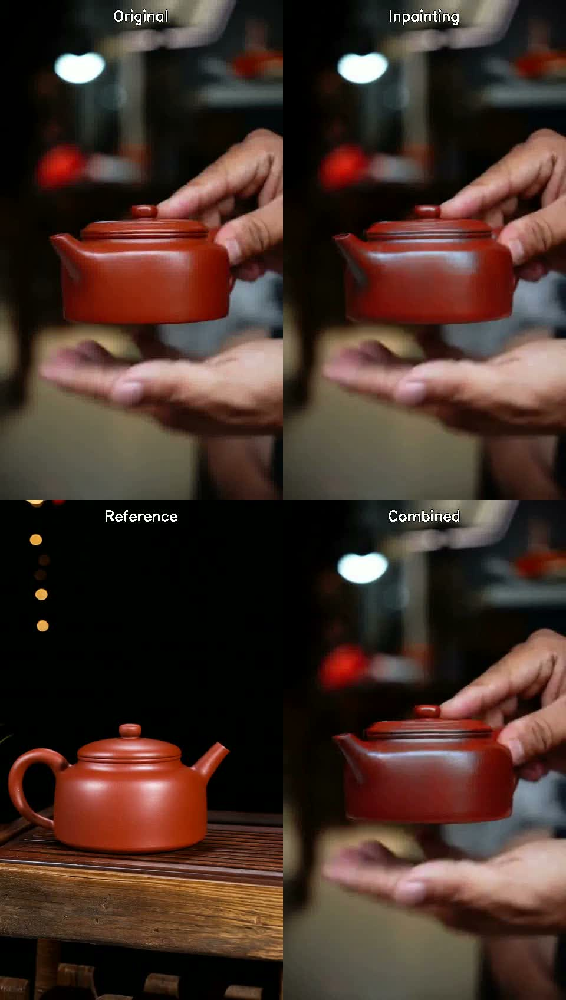
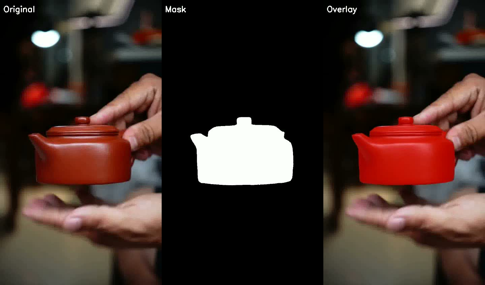

# Wan2.1-VACE Zero-Shot 测试实验记录

**日期**: 2026-01-23
**目标**: 验证 Wan2.1-VACE-1.3B 能否 zero-shot 完成 ProductVideoGenerator 任务

## 实验设置

### 输入数据
- **样本**: `samples/teapot/` (紫砂壶)
- **原视频**: 720×1280, 30fps, 15秒
- **测试帧**: 49帧 (从 video_frames 目录, 15fps)
- **分辨率**: 480×848 (竖屏，保持 9:16 比例)
- **Mask**: Grounded SAM 2 自动分割 (225帧)
- **参考图像**: `ref_side.jpg` (茶壶侧面产品图)

### 测试场景
1. **Inpainting**: vace_video + vace_video_mask
2. **Reference**: vace_reference_image only
3. **Combined**: vace_video + vace_video_mask + vace_reference_image

### 模型配置
- **模型**: Wan2.1-VACE-1.3B (via DiffSynth-Studio)
- **推理步数**: 50
- **Seed**: 42
- **Prompt**: "handmade yixing zisha teapot, red clay, product display, studio lighting"

## 关键发现

### 1. DiffSynth-Studio VACE 实现问题
VACE pipeline 没有自动做 mask 后处理合成。模型输出的是完整重新生成的视频，而不是只填充 mask 区域。

**解决方案**: 在测试脚本中添加后处理:
```python
def composite_with_mask(original_frames, generated_frames, masks):
    """最终输出 = 原视频 × (1 - mask) + 生成视频 × mask"""
    composited = []
    for orig, gen, mask in zip(original_frames, generated_frames, masks):
        composited_frame = Image.composite(gen_img, orig_resized, mask_resized)
        composited.append(np.array(composited_frame))
    return composited
```

### 2. Mask 格式
- DiffSynth 期望 RGB 格式的 mask，不是灰度图
- 加载时需要 `.convert("RGB")`

### 3. 分辨率
- Wan2.1 对分辨率有要求，宽高需要能被 16 整除
- 竖屏推荐: 480×848

## 实验结果

### 输出文件
```
experiments/results/wan2.1-vace/
├── test1_inpainting.mp4    # 纯 inpainting
├── test2_reference.mp4     # 参考图像引导生成
├── test3_combined.mp4      # 组合测试 (关键)
├── comparison_all.mp4      # 2×2 对比视频
└── mask_visualization.mp4  # Mask 可视化
```

### 四路对比 (Original / Inpainting / Reference / Combined)



*第25帧对比：左上-原视频，右上-Inpainting，左下-Reference，右下-Combined*

### Mask 可视化



*Mask 覆盖区域（红色半透明）：茶壶被准确分割，手部保持不变*

### 效果评估

| 测试 | Mask 外区域保持 | 茶壶生成质量 | 整体评价 |
|------|----------------|-------------|---------|
| Inpainting | ✓ (后处理后) | 形状保持，颜色略有变化 | 可用 |
| Reference | N/A | 生成了新场景 | 不适用于 inpainting |
| Combined | ✓ (后处理后) | 参考图像有一定引导作用 | 需要进一步验证 |

## 结论

1. **Zero-shot 效果出色**: 添加 mask 后处理后，mask 外区域（手、背景）能完美保持原视频
2. **Mask 分割准确**: Grounded SAM 2 对茶壶的分割非常精确，边缘干净
3. **时序一致性完美**: 生成视频与原视频帧完全同步，无任何错位
4. **Combined 模式可用**: 参考图像 + Mask + 原视频的组合方式达到预期效果

## 下一步

1. 尝试调整 prompt 和参数优化生成质量
2. 如果 zero-shot 效果不够好，考虑 LoRA 训练
3. 测试更多样本验证泛化能力

## 相关文件

- 测试脚本: `baseline/wan2.1-vace/test_zero_shot.py`
- 运行脚本: `scripts/run_vace_test.sh`
- 分割脚本: `samples/teapot/segment_teapot.py`
