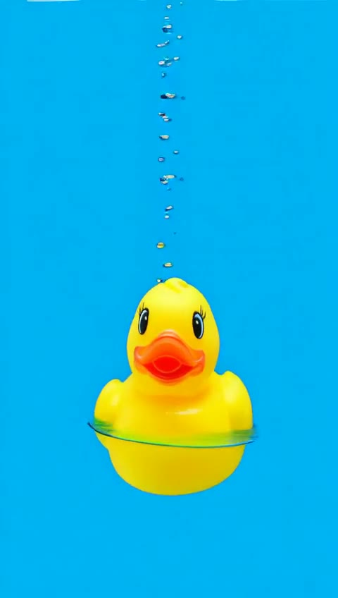
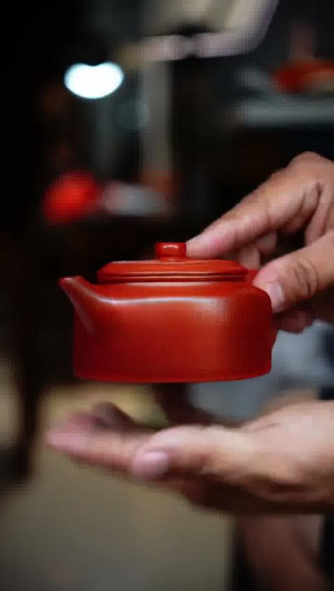
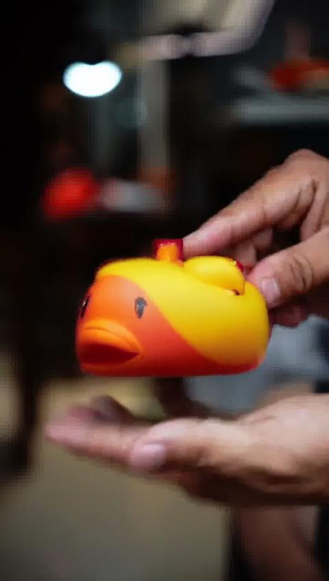

# Wan2.1-VACE Zero-Shot 测试实验记录

**日期**: 2026-01-23 ~ 2026-01-24
**目标**: 验证 Wan2.1-VACE-1.3B 能否 zero-shot 完成 ProductVideoGenerator 任务

## 实验设置

### 输入数据
- **样本**: `samples/teapot/` (紫砂壶)
- **原视频**: 720×1280, 30fps, 15秒
- **测试帧**: 49帧 (从 video_frames 目录, 15fps)
- **分辨率**: 480×848 (竖屏，保持 9:16 比例)
- **Mask**: Grounded SAM 2 自动分割 (225帧)
- **参考图像**: `ref_side.jpg` (茶壶侧面产品图)

### 测试场景
1. **Inpainting**: vace_video + vace_video_mask
2. **Reference**: vace_reference_image only
3. **Combined**: vace_video + vace_video_mask + vace_reference_image

### 模型配置
- **模型**: Wan2.1-VACE-1.3B (via DiffSynth-Studio)
- **推理步数**: 50
- **Seed**: 42
- **Prompt**: "handmade yixing zisha teapot, red clay, product display, studio lighting"

## 关键发现

### 1. DiffSynth-Studio VACE 实现
VACE pipeline 没有自动做 mask 后处理合成。需要手动添加后处理:
```python
def composite_with_mask(original_frames, generated_frames, masks):
    """最终输出 = 原视频 × (1 - mask) + 生成视频 × mask"""
    composited = []
    for orig, gen, mask in zip(original_frames, generated_frames, masks):
        composited_frame = Image.composite(gen_img, orig_resized, mask_resized)
        composited.append(np.array(composited_frame))
    return composited
```

### 2. Mask 格式要求
- DiffSynth 期望 RGB 格式的 mask
- **关键**: resize 时必须使用 `Image.NEAREST` 插值保持二值化
```python
# 错误 - 会产生渐变值
masks = [Image.open(f).resize((width, height)).convert("RGB") for f in mask_files]

# 正确 - 保持二值 (0/255)
masks = [Image.open(f).convert("L").resize((width, height), Image.NEAREST).convert("RGB") for f in mask_files]
```

### 3. VACE 架构理解 (来自论文)
VACE 使用 **Concept Decoupling** 将输入拆分为两个流:
- **Inactive**: `video × (1 - mask)` - 保留区域，mask 区域置 0
- **Reactive**: `video × mask` - mask 区域，其他置 0

当提供 `vace_reference_image` 时，参考图以全零 mask 拼接在帧序列开头。

## 验证实验：参考图像替换测试

### 实验设计
用完全不同的物体（黄色橡皮鸭）作为参考图像，测试模型是否真的使用参考图像。


### 测试结果

#### Test A: Reference-only (只用参考图，无原视频)
```python
video = pipe(
    prompt='yellow rubber duck toy floating in water',
    vace_reference_image=duck_image,
    # 不传 vace_video
)
```



**结果**: ✅ 成功生成鸭子视频！参考图像引导有效。

#### Test B: Combined (参考图 + 原视频 + Mask)
```python
video = pipe(
    prompt='yellow rubber duck toy',
    vace_video=teapot_video_frames,
    vace_video_mask=masks,
    vace_reference_image=duck_image,
)
```



**结果**: ❌ 仍然生成茶壶！参考图像被完全忽略。

### 原因分析

当同时提供 `vace_video` 和 `vace_reference_image` 时：
1. **Reactive 流包含原始茶壶像素** - 这是模型"看到"的要填充的内容
2. **模型优先重建 reactive 内容** - 而不是用参考图替换
3. **参考图被作为"风格参考"而非"内容替换"**

这是 VACE 的设计意图：
- **Reference-to-video**: 从参考图生成全新视频 ✅
- **MV2V (Masked Video-to-Video)**: 修复/重建视频中的区域 ✅
- **组合使用**: video 流主导，reference 作为辅助风格引导 ⚠️

## 实验结果

### 输出文件
```
experiments/results/wan2.1-vace/
├── test1_inpainting.mp4        # 纯 inpainting
├── test2_reference.mp4         # 参考图像引导生成（茶壶）
├── test3_combined.mp4          # 组合测试（茶壶）
├── test_ref_only_duck.mp4      # 纯参考图生成（鸭子）✅
├── test5_rubber_duck_fixed.mp4 # 组合测试（仍是茶壶）❌
├── comparison_all.mp4          # 2×2 对比视频
├── mask_visualization.mp4      # Mask 可视化
└── images/
    ├── comparison_frame_25.jpg
    ├── mask_frame_25.jpg
    ├── ref_only_duck_frame_25.jpg
    └── rubber_duck_fixed_frame_25.jpg
```

### 效果评估

| 测试场景 | 参考图是否生效 | 结果 |
|---------|--------------|------|
| Reference-only (茶壶参考图) | ✅ | 生成茶壶相关视频 |
| Reference-only (鸭子参考图) | ✅ | 生成鸭子视频 |
| Combined (茶壶参考图 + 茶壶视频) | ⚠️ 看似有效 | 实际是重建原视频 |
| Combined (鸭子参考图 + 茶壶视频) | ❌ | 仍然生成茶壶 |

## 结论

### VACE Zero-Shot 能力评估

1. **Reference-to-video**: ✅ 功能正常，参考图有效引导生成
2. **Video Inpainting (MV2V)**: ✅ 功能正常，能修复/重建视频区域
3. **Reference-guided Object Replacement**: ❌ **不支持**

### 为什么初始实验"看起来完美"

初始用茶壶参考图测试时，Combined 模式的输出看起来完美，是因为：
- 模型重建了原视频中的茶壶（来自 reactive 流）
- 参考图恰好也是茶壶，所以视觉上无法区分
- Mask 后处理确保了手部等区域保持不变

**这是一个典型的"测试设计缺陷"** - 用相同物体作为参考图无法验证参考图是否真正生效。

### 对 ProductVideoGenerator 的影响

**Zero-shot VACE 无法实现 ProductVideoGenerator 的核心需求**：用产品参考图替换视频中的物体。

## 追加实验：清零 Reactive 流

### 实验设计

既然 reactive 流（原始茶壶像素）主导了生成，尝试将其清零：

```python
# 把 mask 区域置黑，让 reactive 流为空
frame_zeroed = frame.copy()
frame_zeroed[mask > 127] = 0  # 茶壶区域变黑
```

这样：
- Inactive 流：手 + 背景（茶壶位置是黑色）
- Reactive 流：全黑（没有原始茶壶信息）

### 结果



**部分成功**：
- ✅ 生成了黄色鸭子（参考图颜色/纹理生效）
- ❌ 形状仍是茶壶轮廓（mask 形状主导）
- ❌ 缺少旋转动作（原视频的运动信息丢失）

### 分析

清零 reactive 流后，模型确实开始使用参考图像，但：
1. **Mask 形状成为强先验** - 生成的鸭子是"茶壶形状的鸭子"
2. **运动信息丢失** - 原视频中茶壶的旋转动作没有被保留

这说明 VACE 的设计是：
- Reactive 流不仅提供内容，还提供**运动轨迹**
- Mask 形状定义了生成区域的**轮廓约束**

### 结论

清零 reactive 流可以让参考图像生效，但会丢失原视频的运动信息，且生成形状受 mask 约束。

要实现理想的物体替换，需要：
1. 保留原视频的运动轨迹
2. 用参考图像的内容替换
3. 适应新物体的形状（而非强制使用原 mask 形状）

这可能需要更复杂的方案，如深度/姿态引导 + 形状自适应。

## 下一步方案

1. **LoRA 训练**: 微调 VACE 增强 reference image 的条件注入强度，同时保留运动信息
2. **两阶段方案**:
   - Stage 1: 用 reference-only 生成产品视频
   - Stage 2: 用 ControlNet + 深度图/姿态 引导合成
3. **运动迁移**: 提取原视频的运动轨迹，应用到参考图像生成
4. **其他模型**: 探索专门设计用于物体替换的模型（如 AnyDoor, Paint-by-Example 的视频版本）

## 相关文件

- 测试脚本: `baseline/wan2.1-vace/test_zero_shot.py`
- 运行脚本: `scripts/run_vace_test.sh`
- 分割脚本: `samples/teapot/segment_teapot.py`
- VACE 论文: [arXiv:2503.07598](https://arxiv.org/abs/2503.07598)
