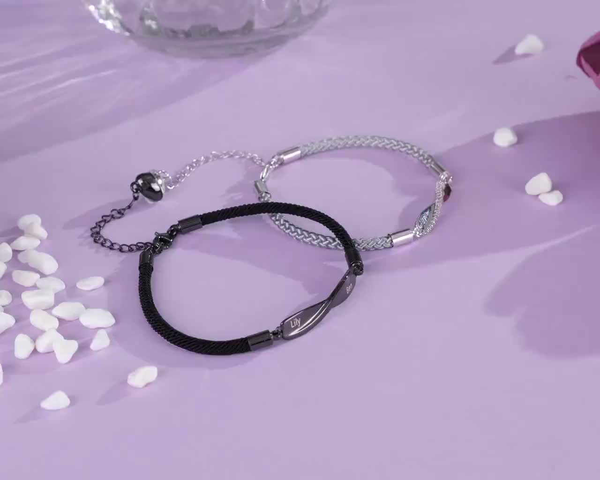
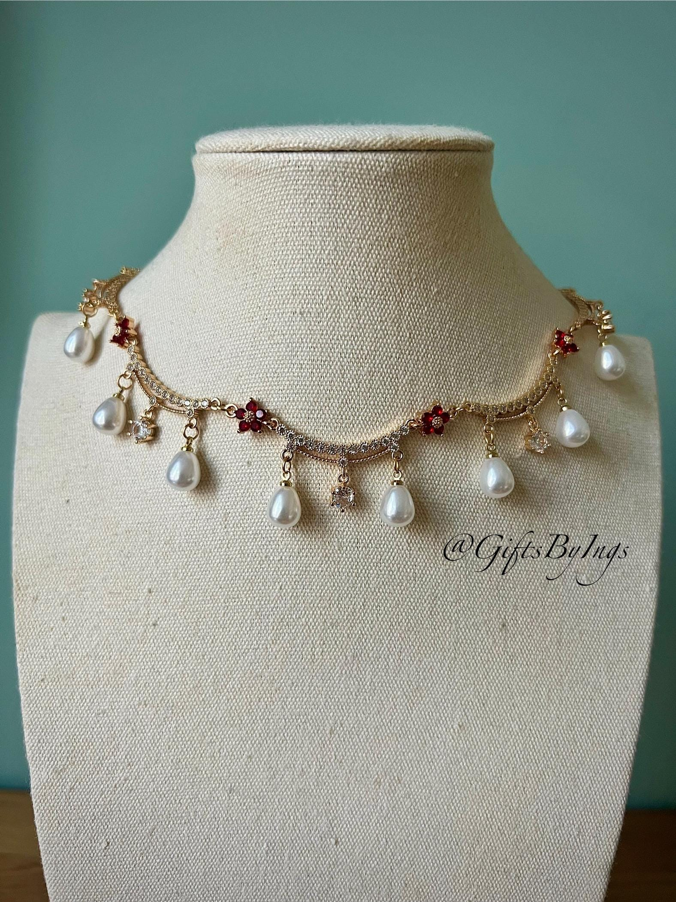

# PVTT Pipeline 测试样本

## Sample 001: Bracelet → Necklace

**任务**: 将手链视频中的商品替换为珍珠项链

### 输入

| 文件 | 来源 | 规格 |
|------|------|------|
| `source_video.mp4` | [pvtt/data/samples](https://github.com/global-optima-research/pvtt/blob/feature/ti2v-inversion/data/samples/personalized-couple-bracelets-settwo.mp4) | 14.8s, 1280x1024, 24fps |
| `target_product.jpg` | pvtt-benchmark/JEWE005 | 珍珠项链产品图 |

### 源视频首帧



情侣手链:
- 黑色手链 (刻字 "Lily")
- 银色手链 (刻字 "Ben")
- 紫色背景 + 白色心形装饰

### 目标商品



珍珠项链 (Choker 款式):
- 金色链条
- 珍珠吊坠
- 红色装饰花

### 难度分析

**目标**: 用珍珠项链替换手链，保持紫色背景平铺展示风格

| 维度 | 难度 | 原因 |
|------|------|------|
| 形状变化 | ⚠️ 高 | 手链 (环形) → 项链 (弧形) |
| 数量变化 | ⚠️ 高 | 2 个手链 → 1 个项链 |
| 光照适配 | ⚠️ 中 | 需适配紫色背景光照 |

### Pipeline 步骤

```
1. 镜头切分: source_video.mp4 → 单镜头片段
2. SAM2 分割: 提取手链 Mask 序列
3. VideoPainter: 移除手链，生成干净背景
4. VideoAnyDoor/InsertAnywhere: 插入珍珠项链
5. 质量评估: VLM 评分
```

### 预期挑战

1. **手链可能被手遮挡** - SAM2 需要处理遮挡
2. **形状差异大** - Box 序列需要调整适配项链尺寸
3. **佩戴位置不匹配** - 手链在手腕，项链在颈部

---

## 实验记录

| 日期 | 步骤 | 文件 | 状态 |
|------|------|------|------|
| 01-20 | 镜头切分 | [shot-detection_2026-01-20.md](shot-detection_2026-01-20.md) | ✅ 完成 |
| 01-20 | SAM2 分割 | [sam2-segmentation_2026-01-20.md](sam2-segmentation_2026-01-20.md) | ✅ 完成 |
| - | VideoPainter 修复 | - | ⏳ 待运行 |
| - | VideoAnyDoor 插入 | - | ⏳ 待运行 |

---

## 镜头切分结果

检测到 **3 个镜头**，平均时长 4.9s：

| Scene | 时间范围 | 帧数 | 文件 |
|-------|----------|------|------|
| 1 | 00:00-07:67 | 184 | `source_video-Scene-001.mp4` |
| 2 | 07:67-10:89 | 77 | `source_video-Scene-002.mp4` |
| 3 | 10:89-14:81 | 94 | `source_video-Scene-003.mp4` |

**Scene 1** 将作为主要测试用例。

---

## 待运行

- [x] 安装 ffmpeg / opencv
- [x] 运行 PySceneDetect 镜头切分
- [x] 运行 SAM2 分割
- [ ] 运行 VideoPainter 修复
- [ ] 运行 VideoAnyDoor 插入
